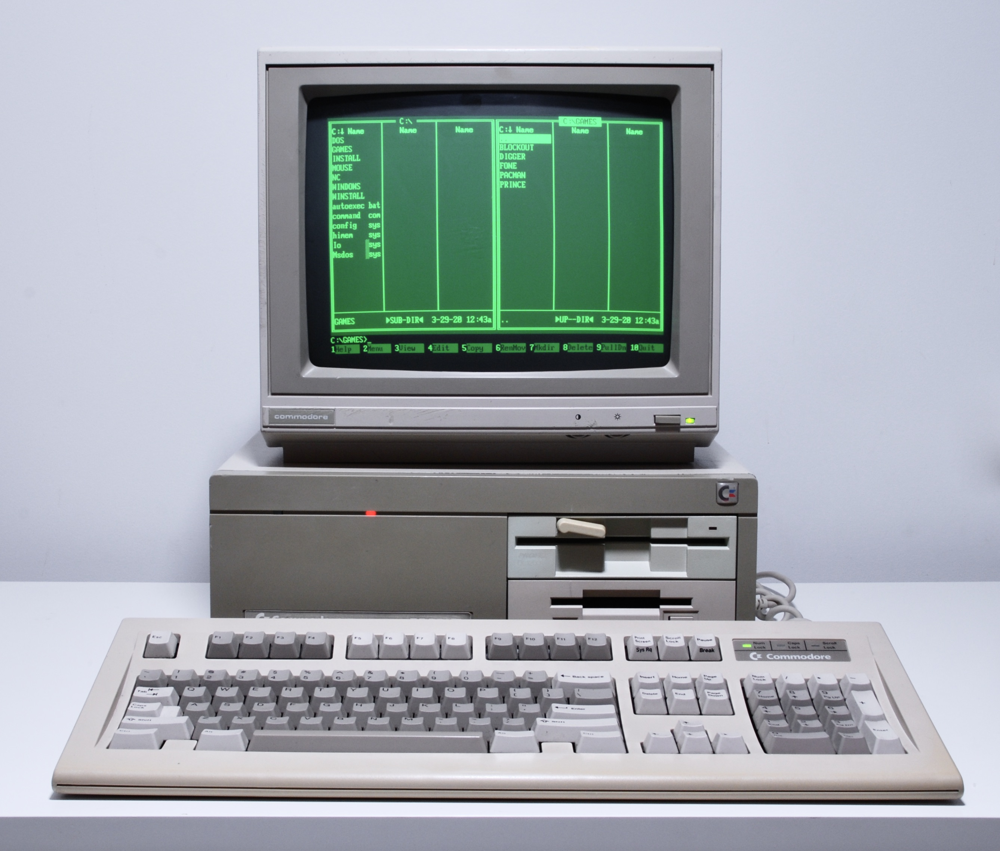
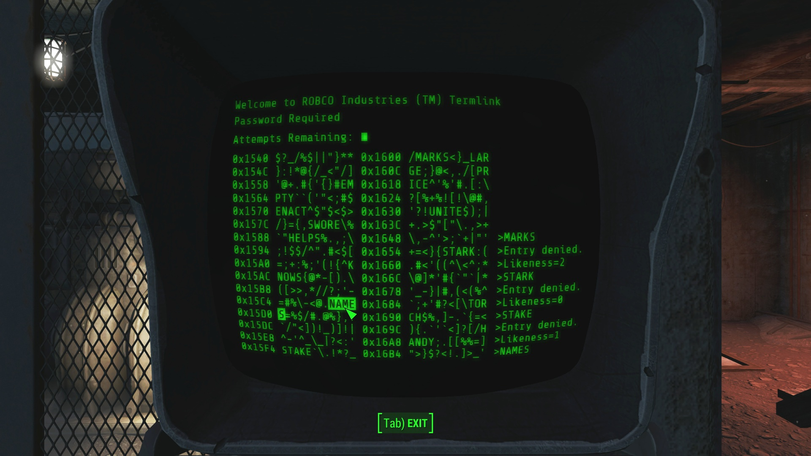
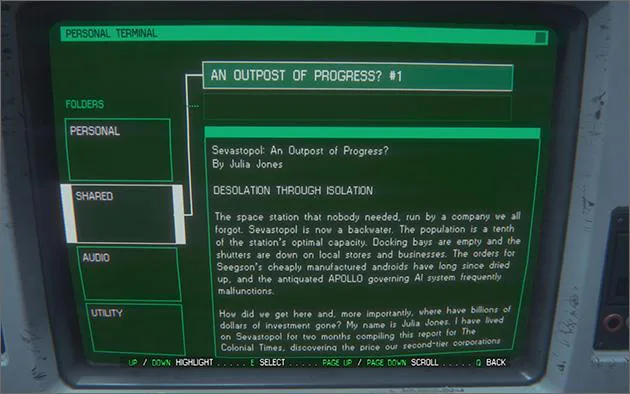

# application-website

This README is for my application website for Founders and Coders!

## Ideas

I'll try to put some of my ideas for my website here broken down into different sections.

### Style

I'm going for an old school computer-y look. Everything will be green and black with "scanlines" on top of everything. Something like this:

I've created a card for my stream using Photoshop in this style and I want to recreate that look using CSS:

All images displayed on the page will be green and black. I can use CSS to achieve this.

### Layout

I wanted to go for a vertical menu bar similar to that found in Alien: Isolation where selecting the menu item on the left changes the content on the right:

The content on the right will be scrollable so that you always have the menu bar and border fixed on screen.

I'll design for mobile first so that by default the menu bar will be at the bottom of the screen flowing left to right with the content view above. If you are viewing on a large screen (by width) or rotate your mobile screen, it will switch to the menu bar on the left flowing top to bottom with content view on the right.

### Content

There will be 4 pages: a landing/home page, a bit about me and why I want to apply, a MTG life total app and a image carousel for my cats, Felt  and Noodle .

### Functionality

#### Menu

I'd like the menu to work so that when you click on a menu item it changes what is in the content view but without changing the URL. [This W3Schools How TO](https://www.w3schools.com/howto/howto_js_vertical_tabs.asp) should help me achieve this.

#### MTG Life App

This will be a basic life counter for Magic: The Gathering that I should be able to use when I play to track life totals of up to 4 players.

I'd like to be able to start by selecting how many players and then have separate life totals displayed on the page and then select the starting life total.

You'll be able to increase and decrease the life of each player in increments of 1 or 5.

#### Cats Image Carousel

This will be a slideshow of pictures of my cats! It will automatically cycle through the images and there will be controls to stop the slideshow and progress backwards and forwards.

I can use [this W3Schools How TO](https://www.w3schools.com/howto/howto_js_slideshow.asp) and [Gregor's recent live coding session](https://discord.com/channels/819243160893915167/839864574936219648/842759893680914442) to help me build this.

## To Do

Here's a list of stuff I need to do!

- [x] Create the HTML, CSS and JS files
- [x] Import and adapt my HTML and CSS from [this repo where I was working on it before](https://github.com/lopezelpesado/old-website)
- [x] Build the menu system
- [x] Put the menu along the bottom
- [x] Put the menu along the left side when viewed on desktop
- [x] Add JS to reset the scroll bar when switching pages
- [x] Import MTG life counter code from [this repo where I was working on it before](https://github.com/lopezelpesado/mtg-life-counter)
- [x] Add more counters for more players
- [x] Add ability to choose the number of players to display the corresponding number of life counters
- [x] Add reset game option
- [x] Write the Home and About pages and format the text
- [x] Change link styling
- [x] Remove image hotlinking
- [x] Build image carousel
- [ ] Style button hover
- [ ] Style the life counter elements
- [ ] Add winner message
- [ ] Add img filter and glow
- [ ] Add option to turn off img filter/glow